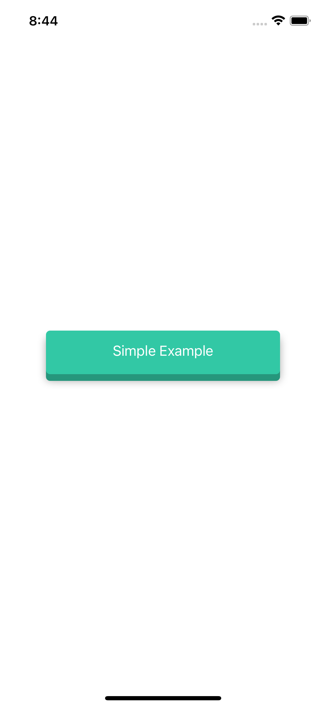

<p align="center">
  <a href="" rel="noopener">
 </a>
</p>

<h3 align="center">🕹 SwiftUI Pressable Button 🕹</h3>

<div align="center">


</div>

---

## 📹 Preview

<p align="center">
    
</p>

## 🏁 Getting Started

### Requirements
* Xcode 11+
* SwiftUI
* iOS 14+
* macOS 10.15+

### Installaion
#### Swift Package Manager(SPM)
    File ➜ Swift Packages ➜ Add Package Dependancy..

```Swift
.package(url: "https://github.com/Changemin/PressableButton", from: "1.1.0")
```

## 🎈Usage
```Swift
PressableButton(action: { YOUR ACTION }) {
    // YOUR VIEW
}
```
* `action` : Functions to execute

#### 🛠Custom Modifiers
```Swift
PressableButton(action: { YOUR ACTION }) {
    // YOUR VIEW
}.accentColor(_ color: color)
.cornerRadius(_ amount: CGFloat)
.frame(width: CGFloat, height: CGFloat)
.enableHaptic(intensity: UIImpactFeedbackGenerator.FeedbackStyle)
.disableHaptic()
```
* `.accentColor()` : Accent color
* `.cornerRadius()` : Corner Radius of the button
* `.frame()` : Size of the button
* `.enableHaptic()` : Enable haptic effect with insensity(`.heavy`, `.medium`, `.light`, `.rigid`, `.soft`)
* `.disableHaptic()` : Disable haptic effect

## Example
#### 👶 Simple
```Swift
import PressableButton

struct ContentView: View {
    var body: some View {
        PressableButton(action: {
            print("Button pressed")
        }) {
            Text("Simple Example").foregroundColor(.white)
        }
    }
}
```
#### Result
<p float="left">
    
    
</p>

### 🛠 Custom Modifiers
```Swift
import PressableButton

struct ContentView: View {
    var body: some View {
        PressableButton(action: {
            print("Button pressed")
        }) {
            Text("PUSH ME !").foregroundColor(.white)
        }
        .enableHaptic(.soft)
        .accentColor(.orange)
        .cornerRadius(0)
    }
}
```

### Result
<p float="left">
    
    
</p>

## ✅ TODO
- [ ] support variable styles `FlatStyle`, `PushButtonStyle`, etc
- [x] add haptic feedback

## 📜 License

CMPressableButton is available under the MIT license. See the `LICENSE` file for more info.

## ✍️ Author

- Byun Kyung Min ➜ [🇰🇷@Changemin](https://github.com/Changemin)
